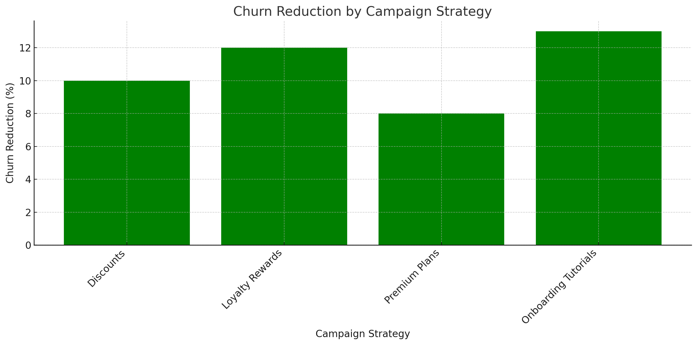
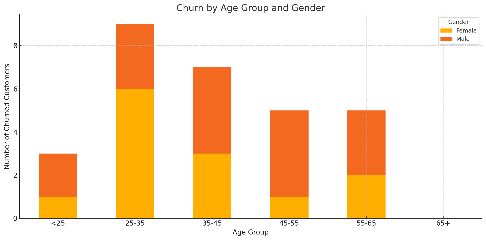
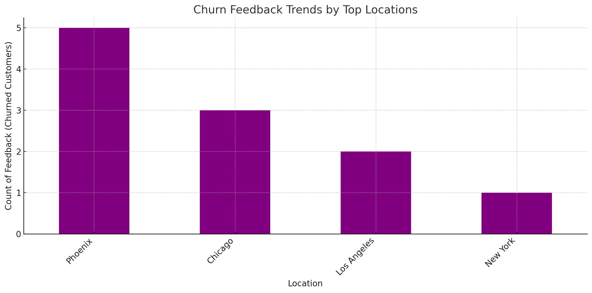
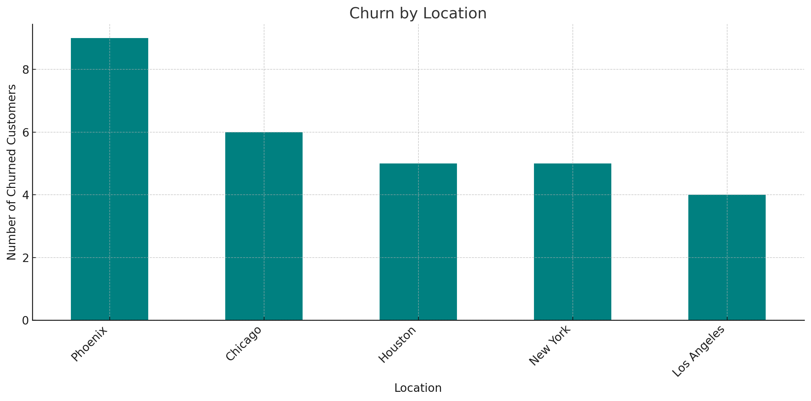
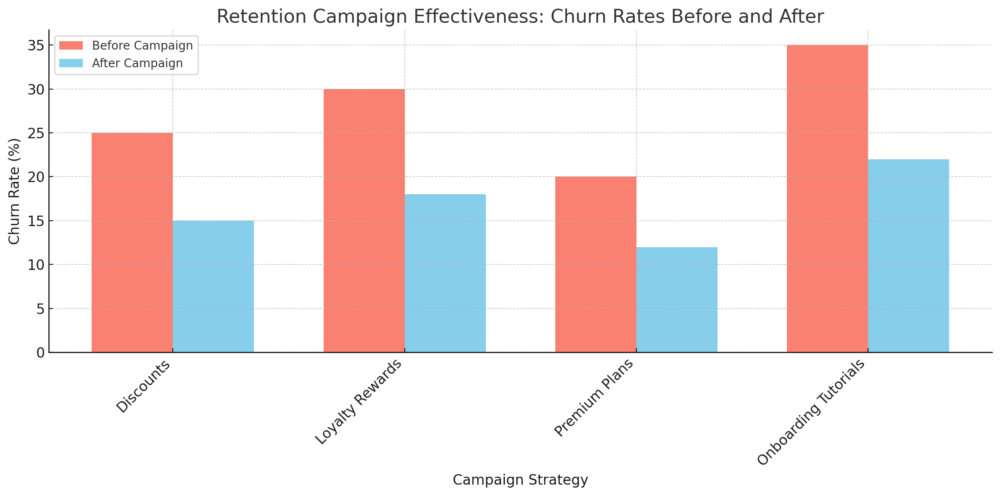

# Churn Visualizations

## Purpose
The visualizations provide a clear view of churn behavior, the factors driving churn, and trends over time. The following visualizations are included:

---

### 1. **Churn Drivers Visualization**
**What it Shows**:  
A bar chart displaying the proportion of customers flagged as churned due to:  
- **Low Usage** (Usage frequency < 5)  
- **Negative Feedback** (Rating < 3)  
- **No Transactions** (No payment activity)  

**How to Interpret**:  
This visualization highlights which factors contribute most to customer churn. Businesses can prioritize actions to address the most significant drivers.  

---

### 2. **Churn Over Time**
**What it Shows**:  
A time-series visualization showing the number of churned customers on a daily, monthly, and yearly basis.  

**How to Interpret**:  
This visualization highlights when customers are most likely to churn. Businesses can take action by identifying seasonal patterns or critical timeframes for customer retention efforts.  

---

### 3. **Churn Distribution**
**What it Shows**:  
A pie chart displaying the proportion of customers who churned versus those who did not churn.  

**How to Interpret**:  
This visualization gives a snapshot of churn vs. non-churn. If the churn rate is high, targeted retention efforts may be required.  

---

### Example Visualizations
   

  

 
